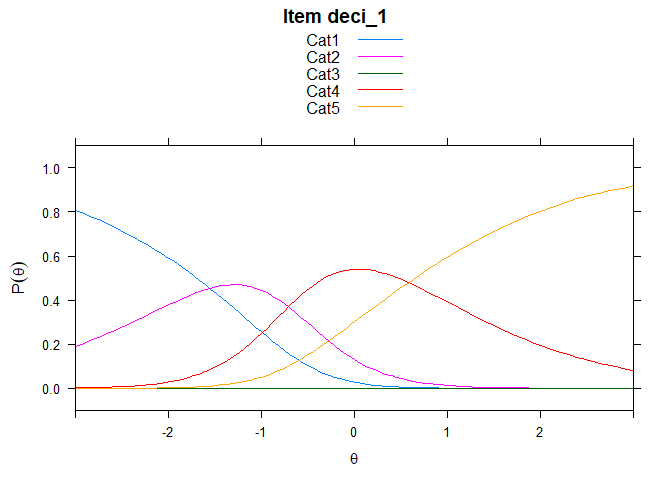

Untitled
================

## GitHub Documents

This is an R Markdown format used for publishing markdown documents to
GitHub. When you click the **Knit** button all R code chunks are run and
a markdown file (.md) suitable for publishing to GitHub is generated.

## Including Code

You can include R code in the document as follows:

``` r
hls2 <- read.csv("data_pre.csv", header = T)
str(hls2)
```

    ## 'data.frame':    748 obs. of  45 variables:
    ##  $ X           : int  1 2 3 4 5 6 7 8 9 10 ...
    ##  $ 癤풹chieve_1: int  0 0 0 2 1 1 3 3 1 3 ...
    ##  $ achieve_2   : int  2 3 2 2 2 1 2 1 0 2 ...
    ##  $ achieve_3   : int  1 2 4 2 0 3 4 0 2 1 ...
    ##  $ achieve_4   : int  0 2 1 0 0 1 2 0 2 1 ...
    ##  $ achieve_5   : int  0 0 1 1 0 1 3 0 1 2 ...
    ##  $ achieve_6   : int  3 2 1 2 2 1 2 0 2 1 ...
    ##  $ self_1      : int  0 0 2 2 1 0 0 0 2 2 ...
    ##  $ self_2      : int  2 4 0 0 2 1 0 0 4 1 ...
    ##  $ self_3      : int  3 0 0 0 0 1 0 0 2 1 ...
    ##  $ self_4      : int  2 4 3 0 2 2 4 0 2 1 ...
    ##  $ self_5      : int  3 4 1 0 2 3 2 4 3 1 ...
    ##  $ self_6      : int  2 3 0 2 0 0 0 0 1 0 ...
    ##  $ self_7      : int  1 0 1 0 1 0 1 1 1 1 ...
    ##  $ self_8      : int  0 0 3 0 2 3 1 1 3 2 ...
    ##  $ curio_1     : int  0 0 1 0 0 0 0 0 4 0 ...
    ##  $ curio_2     : int  0 0 1 0 0 1 0 0 0 0 ...
    ##  $ curio_3     : int  1 0 3 0 0 2 0 4 4 0 ...
    ##  $ curio_4     : int  1 0 1 0 0 0 0 4 0 1 ...
    ##  $ curio_5     : int  1 0 0 4 1 1 0 1 0 1 ...
    ##  $ curio_6     : int  0 0 0 4 2 2 0 0 0 1 ...
    ##  $ curio_7     : int  1 0 0 0 0 0 0 0 0 1 ...
    ##  $ curio_8     : int  2 0 1 2 1 3 0 4 0 4 ...
    ##  $ curio_9     : int  1 0 0 2 0 0 0 0 0 1 ...
    ##  $ curio_10    : int  0 0 0 4 2 0 0 4 0 0 ...
    ##  $ curio_11    : int  0 0 0 0 0 0 0 0 0 1 ...
    ##  $ info_1      : int  0 0 0 0 0 0 0 0 0 0 ...
    ##  $ info_2      : int  0 0 1 0 1 0 0 1 0 0 ...
    ##  $ info_3      : int  0 0 1 0 0 0 0 0 0 1 ...
    ##  $ info_4      : int  0 0 0 0 0 0 2 0 1 2 ...
    ##  $ info_5      : int  0 0 0 0 0 0 0 1 0 0 ...
    ##  $ info_6      : int  2 0 1 0 2 0 2 0 0 3 ...
    ##  $ inter_d_1   : int  1 0 2 4 4 4 2 4 2 2 ...
    ##  $ inter_d_2   : int  1 4 0 2 4 3 2 4 2 1 ...
    ##  $ inter_d_3   : int  2 4 1 2 4 3 2 4 2 2 ...
    ##  $ inter_d_4   : int  1 0 2 1 4 1 4 4 2 0 ...
    ##  $ inter_d_5   : int  1 4 2 2 0 1 2 0 2 0 ...
    ##  $ inter_d_6   : int  0 0 4 2 0 3 2 0 2 2 ...
    ##  $ inter_d_7   : int  0 0 3 0 0 1 0 1 2 1 ...
    ##  $ inter_d_8   : int  0 0 0 3 0 2 0 0 2 1 ...
    ##  $ deci_1      : int  3 4 1 1 4 1 4 4 2 3 ...
    ##  $ deci_2      : int  3 0 2 2 4 4 2 0 2 3 ...
    ##  $ deci_3      : int  2 4 4 2 4 4 4 3 2 3 ...
    ##  $ deci_4      : int  2 2 0 2 2 2 4 4 2 4 ...
    ##  $ deci_5      : int  2 2 4 4 3 2 4 3 2 4 ...

``` r
hls2 <- hls2[2:45]

hls2[hls2 =="2"]<- NA
```

# 모델 피팅

## Including Plots

You can also embed plots, for example:

    ## ------------------------------------------------------------
    ## TAM 3.5-19 (2020-05-05 22:45:39) 
    ## R version 4.0.2 (2020-06-22) x86_64, mingw32 | nodename=5-2박정 | login=user 
    ## 
    ## Date of Analysis: 2020-08-24 14:12:35 
    ## Time difference of 5.238999 secs
    ## Computation time: 5.238999 
    ## 
    ## Multidimensional Item Response Model in TAM 
    ## 
    ## IRT Model: 1PL
    ## Call:
    ## tam.mml(resp = resp)
    ## 
    ## ------------------------------------------------------------
    ## Number of iterations = 1000 
    ## Numeric integration with 21 integration points
    ## 
    ## Deviance = 47707.84 
    ## Log likelihood = -23853.92 
    ## Number of persons = 748 
    ## Number of persons used = 746 
    ## Number of items = 44 
    ## Number of estimated parameters = 177 
    ##     Item threshold parameters = 176 
    ##     Item slope parameters = 0 
    ##     Regression parameters = 0 
    ##     Variance/covariance parameters = 1 
    ## 
    ## AIC = 48062  | penalty=354    | AIC=-2*LL + 2*p 
    ## AIC3 = 48239  | penalty=531    | AIC3=-2*LL + 3*p 
    ## BIC = 48879  | penalty=1170.81    | BIC=-2*LL + log(n)*p 
    ## aBIC = 48316  | penalty=607.82    | aBIC=-2*LL + log((n-2)/24)*p  (adjusted BIC) 
    ## CAIC = 49056  | penalty=1347.81    | CAIC=-2*LL + [log(n)+1]*p  (consistent AIC) 
    ## AICc = 48173  | penalty=464.94    | AICc=-2*LL + 2*p + 2*p*(p+1)/(n-p-1)  (bias corrected AIC) 
    ## GHP = 1.07042     | GHP=( -LL + p ) / (#Persons * #Items)  (Gilula-Haberman log penalty) 
    ## 
    ## ------------------------------------------------------------
    ## EAP Reliability
    ## [1] 0.889
    ## ------------------------------------------------------------
    ## Covariances and Variances
    ##       [,1]
    ## [1,] 0.289
    ## ------------------------------------------------------------
    ## Correlations and Standard Deviations (in the diagonal)
    ##       [,1]
    ## [1,] 0.538
    ## ------------------------------------------------------------
    ## Regression Coefficients
    ##      [,1]
    ## [1,]    0
    ## ------------------------------------------------------------
    ## Item Parameters -A*Xsi
    ##            item   N     M xsi.item AXsi_.Cat1 AXsi_.Cat2 AXsi_.Cat3 AXsi_.Cat4
    ## 1  癤풹chieve_1 567 3.171   -0.860     -1.589      4.672     -3.669     -3.438
    ## 2     achieve_2 416 2.856   -0.767     -2.752      3.555     -4.173     -3.068
    ## 3     achieve_3 510 2.733   -0.426     -1.267      5.256     -2.508     -1.704
    ## 4     achieve_4 495 2.360   -0.195     -1.012      5.379     -1.523     -0.781
    ## 5     achieve_5 506 3.057   -0.836     -2.066      4.257     -4.487     -3.345
    ## 6     achieve_6 445 2.849   -0.528     -1.845      4.311     -3.651     -2.114
    ## 7        self_1 475 2.665   -0.359     -1.398      5.167     -2.652     -1.435
    ## 8        self_2 534 2.787   -0.538     -1.510      5.015     -2.717     -2.152
    ## 9        self_3 484 2.760   -0.467     -1.560      4.978     -2.955     -1.869
    ## 10       self_4 548 2.918   -0.581     -1.409      4.953     -3.227     -2.322
    ## 11       self_5 593 3.204   -0.917     -1.388      4.701     -4.254     -3.669
    ## 12       self_6 500 2.310   -0.210     -0.939      5.463     -1.271     -0.840
    ## 13       self_7 475 2.592   -0.383     -1.629      4.700     -2.664     -1.531
    ## 14       self_8 612 3.208   -0.989     -1.936      3.978     -4.367     -3.955
    ## 15      curio_1 558 3.065   -0.681     -1.126      5.105     -3.323     -2.726
    ## 16      curio_2 506 2.917   -0.616     -1.576      4.525     -3.138     -2.466
    ## 17      curio_3 553 2.976   -0.630     -1.262      5.016     -3.150     -2.519
    ## 18      curio_4 476 2.721   -0.465     -1.362      5.220     -2.384     -1.862
    ## 19      curio_5 558 2.683   -0.475     -1.552      5.093     -2.449     -1.898
    ## 20      curio_6 537 3.052   -0.623     -0.919      5.217     -3.175     -2.494
    ## 21      curio_7 475 2.659   -0.397     -1.385      5.237     -2.343     -1.587
    ## 22      curio_8 493 2.870   -0.543     -1.385      5.049     -2.890     -2.171
    ## 23      curio_9 555 2.773   -0.489     -1.384      5.142     -2.595     -1.957
    ## 24     curio_10 520 2.763   -0.496     -1.442      5.105     -2.551     -1.983
    ## 25     curio_11 482 2.633   -0.430     -1.543      5.155     -2.334     -1.719
    ## 26       info_1 467 1.368    0.365     -0.962      6.483      0.326      1.459
    ## 27       info_2 414 1.966   -0.013     -1.524      5.406     -1.239     -0.054
    ## 28       info_3 443 1.616    0.339     -1.074      6.307     -0.469      1.356
    ## 29       info_4 418 2.423   -0.254     -1.382      5.365     -1.960     -1.017
    ## 30       info_5 476 1.992   -0.011     -1.231      5.911     -0.999     -0.044
    ## 31       info_6 491 2.731   -0.472     -1.573      4.705     -2.601     -1.889
    ## 32    inter_d_1 555 3.050   -0.697     -1.330      4.932     -3.344     -2.787
    ## 33    inter_d_2 561 2.709   -0.413     -1.216      4.995     -2.206     -1.653
    ## 34    inter_d_3 536 2.991   -0.656     -1.443      4.899     -3.281     -2.624
    ## 35    inter_d_4 532 2.814   -0.437     -0.992      5.396     -2.430     -1.747
    ## 36    inter_d_5 443 2.666   -0.436     -1.673      5.044     -2.504     -1.746
    ## 37    inter_d_6 527 2.364   -0.198     -1.097      5.686     -1.573     -0.792
    ## 38    inter_d_7 479 2.693   -0.405     -1.485      5.126     -2.597     -1.620
    ## 39    inter_d_8 500 2.556   -0.314     -1.468      5.226     -2.373     -1.257
    ## 40       deci_1 566 2.864   -0.598     -1.554      4.901     -2.975     -2.391
    ## 41       deci_2 503 2.594   -0.341     -1.369      5.258     -2.382     -1.364
    ## 42       deci_3 560 3.018   -0.705     -1.350      4.952     -3.272     -2.820
    ## 43       deci_4 575 2.969   -0.701     -1.703      4.734     -3.212     -2.802
    ## 44       deci_5 531 2.968   -0.636     -1.340      4.612     -3.196     -2.546
    ##    B.Cat1.Dim1 B.Cat2.Dim1 B.Cat3.Dim1 B.Cat4.Dim1
    ## 1            1           2           3           4
    ## 2            1           2           3           4
    ## 3            1           2           3           4
    ## 4            1           2           3           4
    ## 5            1           2           3           4
    ## 6            1           2           3           4
    ## 7            1           2           3           4
    ## 8            1           2           3           4
    ## 9            1           2           3           4
    ## 10           1           2           3           4
    ## 11           1           2           3           4
    ## 12           1           2           3           4
    ## 13           1           2           3           4
    ## 14           1           2           3           4
    ## 15           1           2           3           4
    ## 16           1           2           3           4
    ## 17           1           2           3           4
    ## 18           1           2           3           4
    ## 19           1           2           3           4
    ## 20           1           2           3           4
    ## 21           1           2           3           4
    ## 22           1           2           3           4
    ## 23           1           2           3           4
    ## 24           1           2           3           4
    ## 25           1           2           3           4
    ## 26           1           2           3           4
    ## 27           1           2           3           4
    ## 28           1           2           3           4
    ## 29           1           2           3           4
    ## 30           1           2           3           4
    ## 31           1           2           3           4
    ## 32           1           2           3           4
    ## 33           1           2           3           4
    ## 34           1           2           3           4
    ## 35           1           2           3           4
    ## 36           1           2           3           4
    ## 37           1           2           3           4
    ## 38           1           2           3           4
    ## 39           1           2           3           4
    ## 40           1           2           3           4
    ## 41           1           2           3           4
    ## 42           1           2           3           4
    ## 43           1           2           3           4
    ## 44           1           2           3           4
    ## 
    ## Item Parameters Xsi
    ##                      xsi se.xsi
    ## 癤풹chieve_1_Cat1 -1.589  0.264
    ## 癤풹chieve_1_Cat2  6.263  0.145
    ## 癤풹chieve_1_Cat3 -8.342  0.145
    ## 癤풹chieve_1_Cat4  0.231  0.090
    ## achieve_2_Cat1    -2.753  0.389
    ## achieve_2_Cat2     6.308  0.139
    ## achieve_2_Cat3    -7.730  0.139
    ## achieve_2_Cat4     1.104  0.120
    ## achieve_3_Cat1    -1.267  0.185
    ## achieve_3_Cat2     6.524  0.117
    ## achieve_3_Cat3    -7.764  0.117
    ## achieve_3_Cat4     0.804  0.105
    ## achieve_4_Cat1    -1.013  0.145
    ## achieve_4_Cat2     6.391  0.107
    ## achieve_4_Cat3    -6.904  0.106
    ## achieve_4_Cat4     0.742  0.114
    ## achieve_5_Cat1    -2.065  0.366
    ## achieve_5_Cat2     6.324  0.164
    ## achieve_5_Cat3    -8.745  0.164
    ## achieve_5_Cat4     1.141  0.106
    ## achieve_6_Cat1    -1.845  0.291
    ## achieve_6_Cat2     6.156  0.143
    ## achieve_6_Cat3    -7.964  0.143
    ## achieve_6_Cat4     1.537  0.126
    ## self_1_Cat1       -1.397  0.198
    ## self_1_Cat2        6.566  0.120
    ## self_1_Cat3       -7.820  0.120
    ## self_1_Cat4        1.218  0.118
    ## self_2_Cat1       -1.510  0.194
    ## self_2_Cat2        6.527  0.115
    ## self_2_Cat3       -7.733  0.114
    ## self_2_Cat4        0.566  0.100
    ## self_3_Cat1       -1.560  0.216
    ## self_3_Cat2        6.539  0.124
    ## self_3_Cat3       -7.933  0.124
    ## self_3_Cat4        1.086  0.112
    ## self_4_Cat1       -1.409  0.222
    ## self_4_Cat2        6.364  0.127
    ## self_4_Cat3       -8.181  0.127
    ## self_4_Cat4        0.905  0.100
    ## self_5_Cat1       -1.388  0.302
    ## self_5_Cat2        6.090  0.172
    ## self_5_Cat3       -8.955  0.172
    ## self_5_Cat4        0.585  0.089
    ## self_6_Cat1       -0.939  0.136
    ## self_6_Cat2        6.402  0.106
    ## self_6_Cat3       -6.736  0.106
    ## self_6_Cat4        0.431  0.110
    ## self_7_Cat1       -1.629  0.197
    ## self_7_Cat2        6.329  0.116
    ## self_7_Cat3       -7.365  0.116
    ## self_7_Cat4        1.133  0.119
    ## self_8_Cat1       -1.936  0.328
    ## self_8_Cat2        5.913  0.155
    ## self_8_Cat3       -8.346  0.155
    ## self_8_Cat4        0.412  0.086
    ## curio_1_Cat1      -1.126  0.225
    ## curio_1_Cat2       6.232  0.142
    ## curio_1_Cat3      -8.429  0.142
    ## curio_1_Cat4       0.598  0.093
    ## curio_2_Cat1      -1.576  0.228
    ## curio_2_Cat2       6.101  0.129
    ## curio_2_Cat3      -7.666  0.129
    ## curio_2_Cat4       0.673  0.101
    ## curio_3_Cat1      -1.262  0.211
    ## curio_3_Cat2       6.279  0.130
    ## curio_3_Cat3      -8.166  0.130
    ## curio_3_Cat4       0.631  0.095
    ## curio_4_Cat1      -1.362  0.186
    ## curio_4_Cat2       6.583  0.120
    ## curio_4_Cat3      -7.604  0.120
    ## curio_4_Cat4       0.522  0.106
    ## curio_5_Cat1      -1.552  0.179
    ## curio_5_Cat2       6.647  0.108
    ## curio_5_Cat3      -7.542  0.108
    ## curio_5_Cat4       0.550  0.099
    ## curio_6_Cat1      -0.919  0.220
    ## curio_6_Cat2       6.137  0.145
    ## curio_6_Cat3      -8.392  0.145
    ## curio_6_Cat4       0.681  0.096
    ## curio_7_Cat1      -1.385  0.186
    ## curio_7_Cat2       6.624  0.118
    ## curio_7_Cat3      -7.580  0.118
    ## curio_7_Cat4       0.755  0.110
    ## curio_8_Cat1      -1.385  0.212
    ## curio_8_Cat2       6.436  0.128
    ## curio_8_Cat3      -7.939  0.128
    ## curio_8_Cat4       0.719  0.104
    ## curio_9_Cat1      -1.384  0.184
    ## curio_9_Cat2       6.527  0.113
    ## curio_9_Cat3      -7.737  0.113
    ## curio_9_Cat4       0.638  0.098
    ## curio_10_Cat1     -1.442  0.189
    ## curio_10_Cat2      6.549  0.116
    ## curio_10_Cat3     -7.656  0.116
    ## curio_10_Cat4      0.568  0.101
    ## curio_11_Cat1     -1.543  0.187
    ## curio_11_Cat2      6.700  0.115
    ## curio_11_Cat3     -7.490  0.115
    ## curio_11_Cat4      0.615  0.108
    ## info_1_Cat1       -0.963  0.114
    ## info_1_Cat2        7.445  0.124
    ## info_1_Cat3       -6.159  0.124
    ## info_1_Cat4        1.132  0.178
    ## info_2_Cat1       -1.524  0.157
    ## info_2_Cat2        6.930  0.117
    ## info_2_Cat3       -6.647  0.117
    ## info_2_Cat4        1.185  0.150
    ## info_3_Cat1       -1.074  0.127
    ## info_3_Cat2        7.382  0.115
    ## info_3_Cat3       -6.775  0.115
    ## info_3_Cat4        1.825  0.190
    ## info_4_Cat1       -1.382  0.178
    ## info_4_Cat2        6.748  0.118
    ## info_4_Cat3       -7.325  0.118
    ## info_4_Cat4        0.944  0.126
    ## info_5_Cat1       -1.231  0.138
    ## info_5_Cat2        7.144  0.107
    ## info_5_Cat3       -6.911  0.107
    ## info_5_Cat4        0.955  0.132
    ## info_6_Cat1       -1.573  0.203
    ## info_6_Cat2        6.278  0.117
    ## info_6_Cat3       -7.308  0.117
    ## info_6_Cat4        0.712  0.106
    ## inter_d_1_Cat1    -1.330  0.232
    ## inter_d_1_Cat2     6.264  0.137
    ## inter_d_1_Cat3    -8.277  0.137
    ## inter_d_1_Cat4     0.557  0.093
    ## inter_d_2_Cat1    -1.216  0.167
    ## inter_d_2_Cat2     6.212  0.108
    ## inter_d_2_Cat3    -7.203  0.108
    ## inter_d_2_Cat4     0.553  0.098
    ## inter_d_3_Cat1    -1.443  0.232
    ## inter_d_3_Cat2     6.343  0.133
    ## inter_d_3_Cat3    -8.180  0.132
    ## inter_d_3_Cat4     0.657  0.097
    ## inter_d_4_Cat1    -0.992  0.177
    ## inter_d_4_Cat2     6.390  0.119
    ## inter_d_4_Cat3    -7.827  0.119
    ## inter_d_4_Cat4     0.683  0.100
    ## inter_d_5_Cat1    -1.673  0.211
    ## inter_d_5_Cat2     6.719  0.121
    ## inter_d_5_Cat3    -7.549  0.121
    ## inter_d_5_Cat4     0.758  0.114
    ## inter_d_6_Cat1    -1.097  0.143
    ## inter_d_6_Cat2     6.785  0.103
    ## inter_d_6_Cat3    -7.260  0.103
    ## inter_d_6_Cat4     0.781  0.111
    ## inter_d_7_Cat1    -1.485  0.201
    ## inter_d_7_Cat2     6.612  0.119
    ## inter_d_7_Cat3    -7.724  0.119
    ## inter_d_7_Cat4     0.977  0.112
    ## inter_d_8_Cat1    -1.468  0.181
    ## inter_d_8_Cat2     6.696  0.111
    ## inter_d_8_Cat3    -7.600  0.111
    ## inter_d_8_Cat4     1.117  0.116
    ## deci_1_Cat1       -1.554  0.203
    ## deci_1_Cat2        6.456  0.116
    ## deci_1_Cat3       -7.876  0.116
    ## deci_1_Cat4        0.584  0.096
    ## deci_2_Cat1       -1.368  0.179
    ## deci_2_Cat2        6.628  0.111
    ## deci_2_Cat3       -7.640  0.111
    ## deci_2_Cat4        1.018  0.112
    ## deci_3_Cat1       -1.350  0.218
    ## deci_3_Cat2        6.303  0.130
    ## deci_3_Cat3       -8.224  0.130
    ## deci_3_Cat4        0.452  0.093
    ## deci_4_Cat1       -1.703  0.225
    ## deci_4_Cat2        6.439  0.120
    ## deci_4_Cat3       -7.947  0.120
    ## deci_4_Cat4        0.410  0.092
    ## deci_5_Cat1       -1.340  0.219
    ## deci_5_Cat2        5.951  0.132
    ## deci_5_Cat3       -7.810  0.132
    ## deci_5_Cat4        0.650  0.098
    ## 
    ## Item Parameters in IRT parameterization
    ##            item alpha   beta tau.Cat1 tau.Cat2 tau.Cat3 tau.Cat4
    ## 1  癤풹chieve_1     1 -0.860   -0.729    7.121   -7.482    1.091
    ## 2     achieve_2     1 -0.767   -1.985    7.075   -6.961    1.872
    ## 3     achieve_3     1 -0.426   -0.841    6.949   -7.338    1.230
    ## 4     achieve_4     1 -0.195   -0.817    6.586   -6.707    0.938
    ## 5     achieve_5     1 -0.836   -1.229    7.159   -7.908    1.978
    ## 6     achieve_6     1 -0.528   -1.317    6.684   -7.433    2.065
    ## 7        self_1     1 -0.359   -1.039    6.923   -7.461    1.576
    ## 8        self_2     1 -0.538   -0.972    7.063   -7.195    1.104
    ## 9        self_3     1 -0.467   -1.092    7.004   -7.465    1.553
    ## 10       self_4     1 -0.581   -0.828    6.943   -7.600    1.485
    ## 11       self_5     1 -0.917   -0.471    7.006   -8.037    1.502
    ## 12       self_6     1 -0.210   -0.729    6.612   -6.524    0.641
    ## 13       self_7     1 -0.383   -1.247    6.712   -6.981    1.516
    ## 14       self_8     1 -0.989   -0.947    6.902   -7.356    1.400
    ## 15      curio_1     1 -0.681   -0.445    6.912   -7.747    1.279
    ## 16      curio_2     1 -0.616   -0.959    6.718   -7.047    1.289
    ## 17      curio_3     1 -0.630   -0.632    6.907   -7.536    1.261
    ## 18      curio_4     1 -0.465   -0.896    7.047   -7.138    0.988
    ## 19      curio_5     1 -0.475   -1.078    7.120   -7.067    1.025
    ## 20      curio_6     1 -0.623   -0.296    6.759   -7.768    1.304
    ## 21      curio_7     1 -0.397   -0.989    7.019   -7.183    1.152
    ## 22      curio_8     1 -0.543   -0.842    6.977   -7.396    1.262
    ## 23      curio_9     1 -0.489   -0.895    7.015   -7.248    1.127
    ## 24     curio_10     1 -0.496   -0.947    7.043   -7.160    1.064
    ## 25     curio_11     1 -0.430   -1.114    7.129   -7.060    1.045
    ## 26       info_1     1  0.365   -1.327    7.081   -6.521    0.768
    ## 27       info_2     1 -0.013   -1.510    6.943   -6.631    1.198
    ## 28       info_3     1  0.339   -1.413    7.041   -7.114    1.486
    ## 29       info_4     1 -0.254   -1.128    7.001   -7.071    1.198
    ## 30       info_5     1 -0.011   -1.220    7.153   -6.899    0.966
    ## 31       info_6     1 -0.472   -1.101    6.750   -6.834    1.185
    ## 32    inter_d_1     1 -0.697   -0.633    6.959   -7.580    1.254
    ## 33    inter_d_2     1 -0.413   -0.803    6.625   -6.788    0.967
    ## 34    inter_d_3     1 -0.656   -0.787    6.998   -7.524    1.313
    ## 35    inter_d_4     1 -0.437   -0.555    6.825   -7.390    1.120
    ## 36    inter_d_5     1 -0.436   -1.237    7.154   -7.112    1.194
    ## 37    inter_d_6     1 -0.198   -0.899    6.981   -7.061    0.979
    ## 38    inter_d_7     1 -0.405   -1.080    7.016   -7.318    1.382
    ## 39    inter_d_8     1 -0.314   -1.154    7.008   -7.285    1.431
    ## 40       deci_1     1 -0.598   -0.956    7.052   -7.278    1.181
    ## 41       deci_2     1 -0.341   -1.028    6.967   -7.299    1.359
    ## 42       deci_3     1 -0.705   -0.645    7.007   -7.519    1.157
    ## 43       deci_4     1 -0.701   -1.002    7.138   -7.246    1.111
    ## 44       deci_5     1 -0.636   -0.703    6.588   -7.171    1.287

    ## Iteration in WLE/MLE estimation  1   | Maximal change  2.1117 
    ## Iteration in WLE/MLE estimation  2   | Maximal change  1.6241 
    ## Iteration in WLE/MLE estimation  3   | Maximal change  1.0457 
    ## Iteration in WLE/MLE estimation  4   | Maximal change  0.515 
    ## Iteration in WLE/MLE estimation  5   | Maximal change  0.1071 
    ## Iteration in WLE/MLE estimation  6   | Maximal change  0.0332 
    ## Iteration in WLE/MLE estimation  7   | Maximal change  0.0089 
    ## Iteration in WLE/MLE estimation  8   | Maximal change  0.0025 
    ## Iteration in WLE/MLE estimation  9   | Maximal change  7e-04 
    ## Iteration in WLE/MLE estimation  10   | Maximal change  2e-04 
    ## Iteration in WLE/MLE estimation  11   | Maximal change  1e-04 
    ## ----
    ##  WLE Reliability= 0.88

<!-- --><!-- --><!-- --><!-- --><!-- --><!-- --><!-- --><!-- --><!-- --><!-- --><!-- --><!-- --><!-- --><!-- --><!-- --><!-- --><!-- --><!-- --><!-- --><!-- --><!-- --><!-- --><!-- --><!-- --><!-- --><!-- --><!-- --><!-- --><!-- --><!-- --><!-- --><!-- --><!-- --><!-- --><!-- --><!-- --><!-- --><!-- --><!-- --><!-- --><!-- --><!-- --><!-- --><!-- -->

    ## ....................................................
    ##  Plots exported in png format into folder:
    ##  C:/Users/user/Documents/R/R_work/rasch/Rasch_1/Plots

Note that the `echo = FALSE` parameter was added to the code chunk to
prevent printing of the R code that generated the plot.
